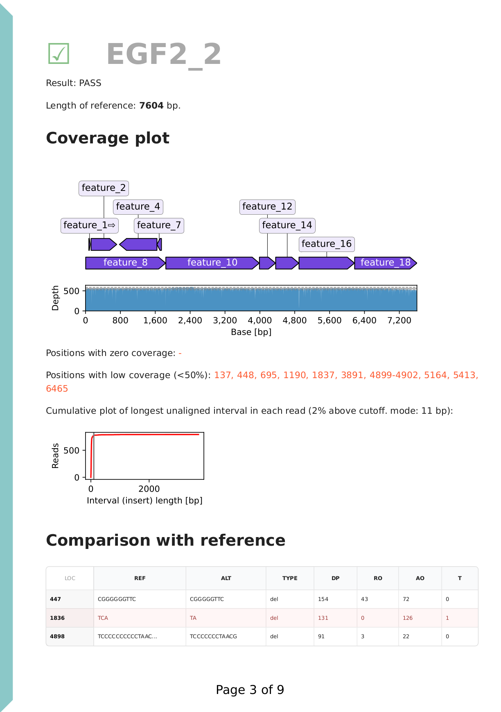
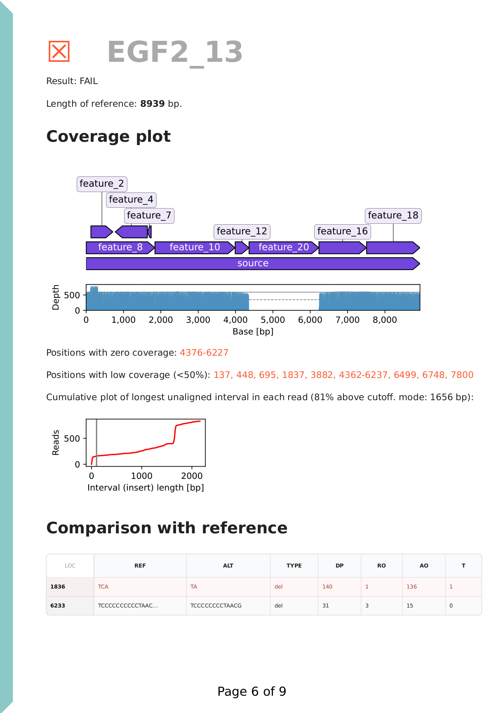
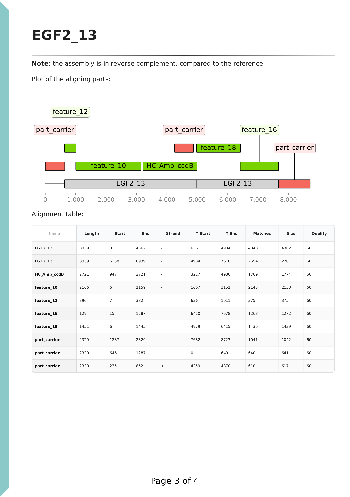

# Sequeduct demo

Demonstration data for the [Sequeduct](https://github.com/Edinburgh-Genome-Foundry/Sequeduct) pipeline.

#### View

Example files and results (`results_example`) can be browsed here or after downloading (cloning) the repository.

#### Run

The pipeline can also be run on the provided data. After installation of the pipeline as described on the [Sequeduct](https://github.com/Edinburgh-Genome-Foundry/Sequeduct) website, download (clone) the repository (click on the "<> Code" button at the top of this page) and run the below commands.

All results are output in a newly created `results` directory.

## Preview

```bash
nextflow run edinburgh-genome-foundry/Sequeduct -r v0.3.1 -entry preview \
    --fastq_dir='fastq_pass' \
    --sample_sheet='sample_sheet.csv' \
    -profile docker
```

The Preview pipeline runs a [NanoPlot](https://github.com/wdecoster/NanoPlot) analysis on the raw reads. This is useful for getting an overview of our sequencing data. The results are saved in the `results/dir1_preview` directory.

The pipeline requires a sample sheet that lists the selected barcodes (directories in the FASTQ folders) that we want to analyse. This allows us to analyse a subset of the data, for example when not all barcodes are used, or when we have multiple projects in the same flowcell run. The sheet must come with the header line as shown in the example.

Please see NanoPlot documentation for details.

## Analysis

```bash
nextflow run edinburgh-genome-foundry/Sequeduct -r v0.3.1 -entry analysis \
    --fastq_dir='fastq_pass' \
    --reference_dir='genbank' \
    --sample_sheet='sample_sheet.csv' \
    --projectname='EGF demo' \
    -profile docker
```

The Analysis pipeline compares the Nanopore reads against the expected (designed) sequence.

The pipeline requires the input data: reference Genbank files (in standard format, and with extension ".gb"), the FASTQ file folder, and a sample sheet that maps reference filenames (without extension) with the subdirectories in the FASTQ folder. (EGF's [Convert Sequence Files](https://cuba.genomefoundry.org/convert_sequence_files) can convert FASTA, Genbank or other formats into the required standard format.) As the pipeline was designed to work with multiple barcodes, the FASTQ folder must be structured with subdirectories for each barcode.

The output files are saved in the `results/dir2_analysis` directory. In this, `n7_results` contain the final results: a [PDF report](/results_example/dir2_analysis/n7_results/Ediacara_report.pdf) (see its Appendix for a detailed description), a list of the entries, and a summary of the results in the [CSV file format](https://en.wikipedia.org/wiki/Comma-separated_values), which can be opened in a spreadsheet software.

<p align="center">

</p>

Each reference DNA (plasmid) is analysed separately, with its corresponding reads. In this example of a DNA construct properly assembled from parts, we have ~500x coverage, with 1 point mutation at position 1836. Other variants at homopolymers are ignored as they're known systemic sequencing errors.

---

<p align="center">

</p>

In this failed example, there is no coverage for feature_20, suggesting that there is an assembly error. The length of the reads (see report) and the insert plot suggest that some other DNA part got assembled in the place of feature_20. We also have the same point mutation present as the previous example. This construct used the same DNA part (feature_8), which suggests that the point mutation was present in the part originally and is not new.

Please see the Appendix of the PDF report, the publication, and the nextflow pipeline code and documentation for more details.

## Review

```bash
nextflow run edinburgh-genome-foundry/Sequeduct -r v0.3.1 -entry review \
    --reference_dir='genbank' \
    --results_csv='results_reviewed.csv' \
    --projectname='EGF demo review' \
    --all_parts='parts_fasta/parts.fasta' \
    --assembly_plan='demo_assembly_plan.csv' \
    -profile docker
```

The Review pipeline aligns a user-defined list of sequences against the variant call consensus – or a *de novo* plasmid sequence assembled with Canu – and reports the alignments. This is useful for evaluating plasmids that are constructed from parts to clarify whether we have part or sample mix-ups, recombination events or overhang misannealing.

This pipeline can only be run after running the Analysis pipeline, as it uses the generated files. It requires the reference Genbank files, the sequences in a single FASTA file, and a sheet specifying which samples we want to run for analysis of consensus sequences, and which for analysis of *de novo* assemblies. Optionally, an [assembly plan](/demo_assembly_plan.csv) can be specified, which lists which sequences we expect to be present for each reference sequence. This information is used in the report for an easier interpretation of results.

The results are saved in the `results/dir3_review` directory. Please see the Appendix of the consensus review [PDF report](/results_example/dir3_review/n2_consensus_results/consensus_review.pdf), or the *de novo* review [PDF report](/results_example/dir3_review/n5_de_novo_results/de_novo_review.pdf) for a description.

In this example, the feature_8 sequence is specified as HC_Amp_ccdB, which is a plasmid backbone. The software automatically recognises if the *de novo* assembly is in reverse complement to the reference, as noted on the top of the page. Moreover, the sequence assembled from reads do not (necessarily) have the same origin as our reference.

<p align="center">

</p>

We can see that the annotations are coloured based on whether the supplied sequence is expected in the plasmid (green shows expected parts). DNA parts come in a carrier backbone plasmid, and this was also supplied with the name 'part_carrier'. We can see that in the failed cloning, this carrier, which shows as unexpected (in red), was assembled instead of the intended insert. Upon inspection of the [*de novo* assembly FASTA](/results_example/dir3_review/n3_de_novo_assembly/trimmed/barcode12_denovo.fasta), we can see the presence of KanR, a resistance marker of the carrier plasmid, and a recognition site for the restriction enzyme used for the assembly (BsmBI). We can also see that the part carrier plasmid sequence also aligns to HC_Amp_ccdB, as they have a near-identical *ori* region.

## Assembly

```bash
nextflow run edinburgh-genome-foundry/Sequeduct -r v0.3.1 -entry assembly \
    --fastq_dir='fastq_pass' \
    --assembly_sheet='de_novo_assembly_sheet.csv' \
    -profile docker
```

A standalone Assembly pipeline creates *de novo* assembly sequences, without any reference files. It requires the FASTQ files, and a sample sheet listing the barcodes and corresponding expected DNA (plasmid) length (in kbp). The results are saved in the `results/dir4_assembly` directory.

## Notes

Please use the [Sequeduct](https://github.com/Edinburgh-Genome-Foundry/Sequeduct) project's page to file any issues or comments. See the [main page](https://github.com/Edinburgh-Genome-Foundry) for other ways of contact.

Copyright 2023 Edinburgh Genome Foundry, University of Edinburgh
