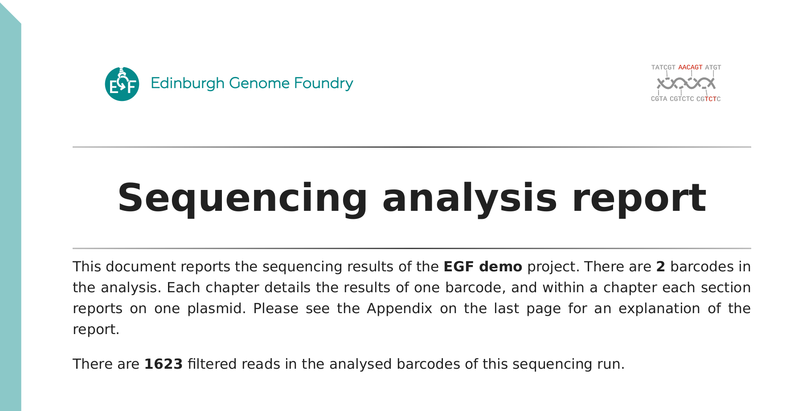
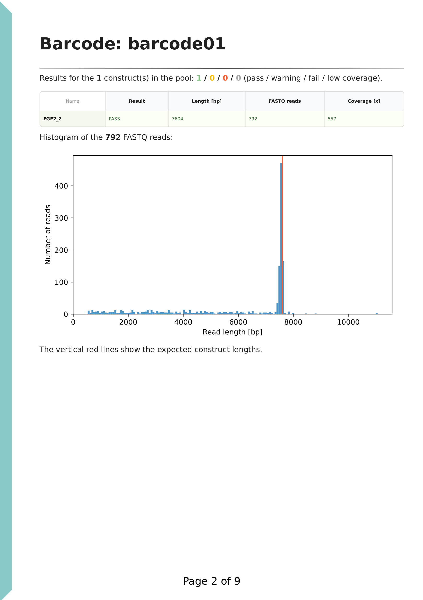
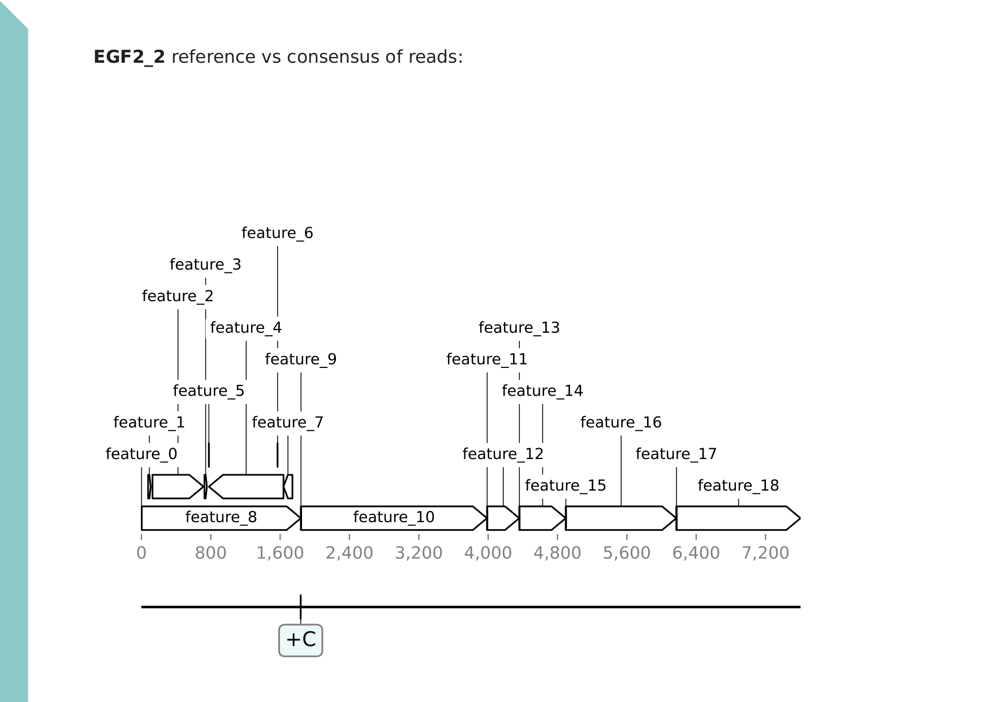
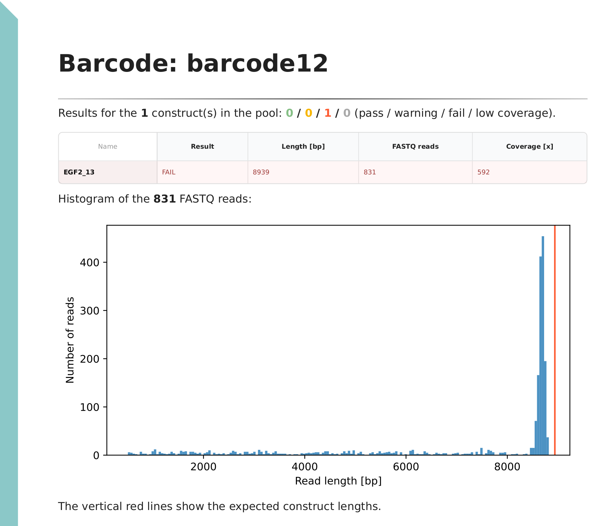
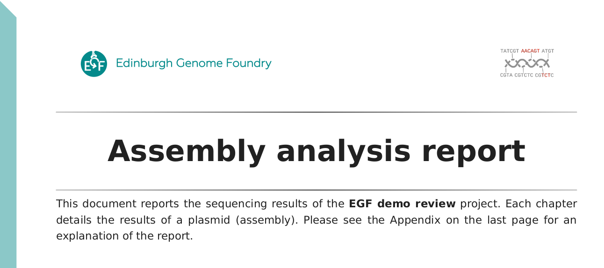
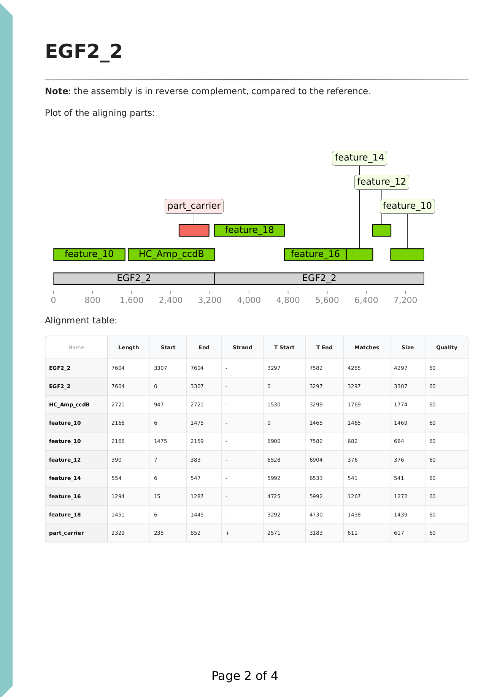

# Sequeduct demo

This repository contains demonstration data and results for the [Sequeduct](https://github.com/Edinburgh-Genome-Foundry/Sequeduct) pipeline. Guidelines for interpreting the results are also provided here.

#### View

Example files and results (`results_example`) can be browsed here or after downloading (cloning) the repository.
Certain intermediate analysis files in a few directories were not included (i.e. these directories are empty), due to the size of these generated files.

#### Run

The pipeline can also be run on the provided data. After installation of the pipeline as described on the [Sequeduct](https://github.com/Edinburgh-Genome-Foundry/Sequeduct) website, download (clone) the repository (click on the "<> Code" button at the top of this page) and run the below commands.

All results are output in a newly created `results` directory.

## Preview

```bash
nextflow run edinburgh-genome-foundry/Sequeduct -r v0.3.1 -entry preview \
    --fastq_dir='fastq_pass' \
    --sample_sheet='sample_sheet.csv' \
    -profile docker
```

The Preview pipeline runs a [NanoPlot](https://github.com/wdecoster/NanoPlot) analysis on the raw reads. This is useful for getting an overview of our sequencing data. The results are saved in the `results/dir1_preview` directory.

The pipeline requires a sample sheet that lists the selected barcodes (directories in the FASTQ folders) that we want to analyse. This allows us to analyse a subset of the data, for example when not all barcodes are used, or when we have multiple projects in the same flowcell run. The sheet must come with the header line as shown in the example.

Please see NanoPlot documentation for details.

It's recommended to examine the plots in order to check the overall quality of the run. The histograms provide information on the number of reads obtained, the quality distribution and the potential presence of plasmid dimers. With this information, we can proceed with selected samples in the Analysis pipeline.

## Analysis

```bash
nextflow run edinburgh-genome-foundry/Sequeduct -r v0.3.1 -entry analysis \
    --fastq_dir='fastq_pass' \
    --reference_dir='genbank' \
    --sample_sheet='sample_sheet.csv' \
    --projectname='EGF demo' \
    -profile docker
```

The Analysis pipeline compares the Nanopore reads against the expected (designed) sequence.

The pipeline requires the following input data: reference Genbank files (in standard format, and with extension ".gb"), the FASTQ file folder, and a sample sheet that maps reference filenames (without extension) with the subdirectories in the FASTQ folder. (EGF's [Convert Sequence Files](https://cuba.genomefoundry.org/convert_sequence_files) can convert FASTA, Genbank or other formats into the required standard format.) As the pipeline was designed to work with multiple barcodes, the FASTQ folder must be structured with subdirectories for each barcode.

The output files are saved in the `results/dir2_analysis` directory. In this, `n7_results` contain the final results: a [PDF report](/results_example/dir2_analysis/n7_results/Ediacara_report.pdf), a list of the sample analysed, and a summary of the results in the [CSV file format](https://en.wikipedia.org/wiki/Comma-separated_values). The PDF report describes the results in detail, as shown below (see its Appendix for a detailed description). The sample list details the relevant result files for for each analysed sample entry ([entries.csv](/results_example/dir2_analysis/n7_results/entries.csv)). The [results summary file](/results_example/dir2_analysis/n7_results/results.csv) can be opened in a spreadsheet software and revised based on the report, following the procedure described below.

The report is structured into chapters, one for each FASTQ subdirectory (i.e. barcode). Note that the reads are not required to be derived from barcoded samples, as the pipeline does not utilise any barcoding information. Therefore any set of FASTQ files can be used, whether they originated from non-barcoded sequencing, or from demultiplexed data from a custom barcoding protocol. Each chapter consists of one or more sections that each describe the results for a given reference (plasmid). This structure allows future expansion of the pipeline to multiplexed samples, but currently this is not implemented.

Report cover page:

<p align="center">

</p>

The cover page contains basic information about the run, such as the number of reads analysed.

#### First chapter or FASTQ directory (barcode)

Chapter cover page:

<p align="center">

</p>

The first line summarises the results for the FASTQ directory, followed by a table of key statistics. A histogram of filtered read lengths is displayed. If we have mostly full length reads (e.g. linearised plasmids or plasmids from rapid barcoding kit), then the peak can be used for estimating the size of the plasmid. Wrong size indicates large structural variation (insertion / deletion), sample mixup or errors in the sample spreadsheet.

Section (first page): coverage plot

<p align="center">

</p>

Each reference DNA (plasmid) is analysed separately, with its corresponding reads. A result call (fail / pass / low coverage / warning) is assigned to each section. It's recommended to revise this, based on the contents of the section. A coverage plot is displayed under the reference sequence (plasmid) map. In this example of a DNA construct properly assembled from parts, we have ~500x coverage, evenly covering the full length of the sequence, therefore we can exclude large deletions.
Note that to include tolerance and due to potential adapter sequences, unaligned read cutoff is set to 100 bp and shown with a grey vertical line.

The cumulative plot of longest unaligned intervals also suggests that there are no regions in the reads that don't align to the reference, suggesting that there are no large insertions either.

Finally, a simplified variant call format (VCF) table lists all detected small variants (SNPs and indels). Homopolymer stretches are known to produce systemic sequencing errors, therefore these are not considered true variants. This is confirmed by the disagreement between the reads: as seen in the reference / alternate allele observation counts (RO / AO columns).

We find one point mutation at position 1836.

Section (second page): variant plot

<p align="center">

</p>

The second page shows the plasmid map with variant annotations, for an easy overview. (Variants at homopolymers are ignored as explained above.) A [consensus file](/results_example/dir2_analysis/n6_consensus/barcode01_EGF2_2_consensus.fa) of true variants is also provided for each barcode. This consensus is provided in the FASTA format and is derived from the reference by applying the variant modifications.

---

#### Second chapter

<p align="center">

</p>

The second example plasmid was flagged as a failed sample. The histogram of reads suggests that the plasmid is smaller than what we expect.

<p align="center">

</p>

This was a failed plasmid assembly. We see that there is no coverage for feature_20, indicating that there is an assembly error. The insert plot shows that the majority of reads have a non-aligning segment of ~1700 bp. This suggests that some other DNA part got assembled into the plasmid, instead of feature_20. Further analysis and explanation is provided in the Review section below.

We also have the same point mutation present as in the previous example, however, note that variant call does not detect structural variants such as large deletions or insertions. In this case, the consensus FASTA sequence should not be used.

This construct used the same DNA part (feature_8) as the previous example, which suggests that the point mutation was present in the DNA part originally and is not created during the cloning and amplification work.

Please see the Appendix of the PDF report, the publication, and the Nextflow pipeline code and documentation for more details.

#### Setting parameters

Key pipeline parameters can be set by the user. The list of parameters and their default settings can be found in the [nextflow.config](https://github.com/Edinburgh-Genome-Foundry/Sequeduct/blob/main/nextflow.config) file. The default parameters work very well for most sequencing runs, but we provide a few suggestions below for setting different values, depending on use-case.

`--max_len_fraction=1.5` : the maximum read length cutoff is used to filter reads by NanoFilt. The default is 1.5x of the reference sequence length. Set this to a higher value to include plasmid dimers, or if the reference sequence is a short subsegment of the sequenced DNA.

`--min_length=500` : the value is in number of nucleotides (bp). Most plasmids are longer than 1 kbp and linearisation or fragmentation results in mostly full length reads. Set the value lower if the DNA is shorter or the reads are more fragmented.

`--quality_cutoff=10` : this PHRED quality score cutoff parameter is used by NanoFilt. Set to a higher value to work with better reads or if there is an overabundance of reads. Set to a lower value to use more reads if the reads are lower quality than usual, e.g. due to an issue with a sequencing run or sequencer software. Results of the Preview pipeline can be used for determining an appropriate cutoff.

`--freebayes.args` : these are used by the [freebayes](https://github.com/freebayes/freebayes) variant detector. Set `--min-base-quality` PHRED score cutoff higher/lower to use fewer/more bases during variant call. The variant call table (DP column) in the report can help in determining a different cutoff. If the values in the DP column are very low in contrast to high sequencing depth or coverage, then try a lower value such as 15. In most cases the default will be the most suitable.

#### Summary of revising steps

* Open a copy of `results.csv` in a spreadsheet software.
* Create a new column and review the results for each sample in the PDF report.
* Check number of reads and coverage. Insufficient coverage is usually marked with 'low coverage'.
* On the histogram, check read length distribution (fragmentation). If we have sufficient number of full-length reads, then compare the peak against the expected length (vertical red line). Differences can indicate large indels.
* Inspect the coverage plot for uncovered regions, which indicate deletions.
* Interpret the cumulative plot of longest unaligned intervals to find large inserts.
* Review the variant call format table and note variants. Note that large indels are not displayed in the table.
* Reject or accept samples, depending on the requirements of the project.
* If a large insertion or deletion is found, perform a _de novo_ assembly on the sample. For large insertions, the Review pipeline can help in clarifying the nature of the error.

## Review

```bash
nextflow run edinburgh-genome-foundry/Sequeduct -r v0.3.1 -entry review \
    --reference_dir='genbank' \
    --results_csv='results_reviewed.csv' \
    --projectname='EGF demo review' \
    --all_parts='parts_fasta/parts.fasta' \
    --assembly_plan='demo_assembly_plan.csv' \
    -profile docker
```

The Review pipeline aligns a user-defined list of sequences against a _de novo_ plasmid sequence, and then reports the alignments. This is useful for evaluating plasmids that are constructed from parts to clarify whether we have part or sample mix-ups, recombination events or overhang misannealing.

The _de novo_ consensus sequence is provided in the FASTA format and is assembled entirely from the reads, using [Canu](https://github.com/marbl/canu), without utilising the reference file.

This pipeline can only be run after running the Analysis pipeline, as it uses the generated files. It requires the reference Genbank files, the sequences in a single FASTA file, and a sheet specifying which samples we want to review. This sample sheet is the `results.csv` file from the Analysis run, with requested samples marked with `1` in the `Review_de_novo` column. (Other marker value can be set with the `--denovo_true` parameter.) There is also a `Review_consensus` column for specifying samples to be analysed using the _variant call consensus_ sequences, but this is not recommended due to issues mentioned above. Optionally, an [assembly plan](/demo_assembly_plan.csv) can be specified, which lists which sequences we expect to be present for each reference sequence. This information is used in the report for an easier interpretation of results.

The results are saved in the `results/dir3_review` directory. Please see the Appendix of the consensus review [PDF report](/results_example/dir3_review/n2_consensus_results/consensus_review.pdf), or the _de novo_ review [PDF report](/results_example/dir3_review/n5_de_novo_results/de_novo_review.pdf) for a description.

The report greets the user with a cover page:

<p align="center">

</p>

This is followed by one chapter for each sample:

<p align="center">

</p>

On this page, a plot of the aligning parts is displayed against the [_de novo_ assembled sequence](/results_example/dir3_review/n3_de_novo_assembly/trimmed/barcode01_denovo.fasta). There are no feature annotations as the assembly was created from the reads, and the parts were supplied in unannotated FASTA format. The reference sequence is also aligned against the _de novo_ assembly, shown in grey. The annotations are coloured based on the assembly plan. Green colour indicates expected parts, and red colour indicates unexpected parts.

We can see that the green parts cover the full region of the _de novo_ sequence, and the grey reference also fully aligns, indicating that the assembly is correct. We note that the sequence assembled from reads do not (necessarily) have the same _origin_ as our reference. (Circular sequences are stored in a "linear" format as a sequence of letters, and the first nucleotide is the origin of the sequence, as stored in the file.) The DNA parts were in a carrier backbone plasmid, and this was also supplied with the name 'part_carrier'. The _ori_ region of this carrier plasmid is nearly identical to the _ori_ of the backbone, 'HC_Amp_ccdB', therefore it aligns and shows on the plot. The software automatically recognises if the _de novo_ assembly is in reverse complement to the reference, as noted on the top of the page.

The next chapter shows results for the failed assembly product:

<p align="center">

</p>

We can see that the part carrier backbone, displayed in red, was assembled instead of the intended insert. Upon inspection of the corresponding [_de novo_ assembly FASTA](/results_example/dir3_review/n3_de_novo_assembly/trimmed/barcode12_denovo.fasta), we can find the presence of KanR, a resistance marker of the carrier plasmid, and a recognition site for the restriction enzyme used for the assembly (BsmBI). A separate part carrier _ori_ sequence alignment is also present, as discussed above.

## Assembly

```bash
nextflow run edinburgh-genome-foundry/Sequeduct -r v0.3.1 -entry assembly \
    --fastq_dir='fastq_pass' \
    --assembly_sheet='de_novo_assembly_sheet.csv' \
    -profile docker
```

The standalone Assembly pipeline creates _de novo_ assembly sequences, without any reference files. It requires the FASTQ files, and a sample sheet listing the barcodes and corresponding expected DNA (plasmid) length (in kbp). The results are saved in the `results/dir4_assembly` directory.

Note that sometimes the assembled sequence is made up of two consecutive sequences of the reference (with double length). This "duplication" happens when reads are derived from random segments of a circular sequence, such as a plasmid, and joined by an assembler. Canu, the assembler, tries to identify whether the sequence is duplicated, but this automatic identification is not always successful. The result of the identification is shown in the `suggestCircular` parameter of the consensus FASTA header (sequence name).

## Notes

Please use the [Sequeduct](https://github.com/Edinburgh-Genome-Foundry/Sequeduct) project's page to file any issues or comments. See the [main page](https://github.com/Edinburgh-Genome-Foundry) for other ways of contact.

Copyright 2023 Edinburgh Genome Foundry, University of Edinburgh
